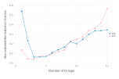

```@meta
CurrentModule = FuzzyCRegression
```

# FuzzyCRegression.jl manual

This package implements the heterogeneous effects estimator from [Lewis, Melcangi, Pilossoph, and Toner-Rodgers (2022)](https://drive.google.com/file/d/1U_MJHtJcB7H1Edv3xceilU_HJoxhLssP/view) in Julia. 

## Fuzzy C-Regression

Fuzzy C-Regression (FCR) is a method for estimating heterogeneous effects in settings with grouped patterns of unobserved heterogeneity. It extends the "Fuzzy C-Means" clustering algorithm to regression settings.

FCR can be used to estimate ["grouped fixed effects"](https://onlinelibrary.wiley.com/doi/abs/10.3982/ECTA11319) (a constant term for each group) as well as heterogeneous coefficients.

#### FCR objective function
Consider a linear model with grouped heterogeneity:

$$y = \sum_{g=1}^G\mu_{g} \theta_{g}X+\varepsilon$$
where $X$ are covariates (which could simply be a constant), $\theta_{g}$ represent group-specific coefficients for groups $g=1,\ldots,G$, and $\mu_{g}$ represent group weights which sum to 1. FCR is concerned with jointly estimating $\theta$ and $\mu$ for each group.

The FCR objective function takes the form:

$$L^{FCR}_m\left(\theta,\mu\right)=\mathbb{E}\left[\sum_{g=1}^{G}\mu_{g}^{m}\left\Vert y-\theta_g X\right\Vert ^{2}\right]$$

The regularization parameter $m > 1$ governs the "fuzziness" of the FCR clusters, where group membership becomes binary as $m \rightarrow 1^+$. The weights are defined as

$$\mu_{g}\left(y,X;\theta,m\right)=\left(\sum_{h=1}^{G}\frac{\left\Vert y-\theta_g X\right\Vert ^{2/\left(m-1\right)}}{\left\Vert y-\theta_h X\right\Vert ^{2/\left(m-1\right)}}\right)^{-1} \text{ for } g=1,\ldots,G$$


Combing these two equations, we can write the FCR objective as a continuous function of only the group-specific errors $||y-\theta_gX||$:

$$J^{FCR}\left(\theta\right)=\mathbb{E}\left[\left(\sum_{g=1}^{G}\left\Vert y-\theta_g X\right\Vert ^{-2/\left(m-1\right)}\right)^{1-m}\right]$$

Thus, for fixed $m$, the FCR function is differentiable and can be written as a standard GMM problem. 

#### Useful properties

  - __Fast:__ FCR can be solved in a single step through standard non-linear minimization. This makes it substantially faster than previous approaches, which require iteration over all possible groupings of units.

  - __Customizable:__ Choosing the fuzzy tuning parameter $m$ allows FCR to better accommodate the uncertainty of group membership in realistic datasets, where noise means that cluster membership cannot be ascertained with certainty. Moreover, it means that FCR can recover the full distribution of effects when heterogeneity is not fully discrete.

  - __Inference:__ Since FCR is a GMM problem, analytic standard errors can be derived from standard theory.

## Package installation

FuzzyCRegressions.jl can be installed using:

```julia
Pkg.add("FuzzyCRegression")
```
This adds the latest version of the package and its dependencies, which include [Optim.jl](https://julianlsolvers.github.io/Optim.jl/stable/) for minimization and [ForwardDiff.jl](https://juliadiff.org/ForwardDiff.jl/stable/) for automatic differentiation. 

## Fitting the FCR model
There are two ways to fit an FCR model, depending on whether the data is stored as a [DataFrame](https://dataframes.juliadata.org/stable/) or as a set of arrays.

If the dataset is stored as a DataFrame, the model can be fit using `fit(df,y,X,G,m,...)`, where the variables are referenced by their column names. `G` specifies the number of groups and `m` sets the regularization parameter (tips for selecting these options are discussed below). `fit` returns an object of type `FCRModel`, to which a number of methods can be applied.

For example, using the iris dataset from [RDatasets](https://github.com/JuliaStats/RDatasets.jl):

```julia
using FuzzyCRegression, RDatasets

iris = dataset("datasets", "iris")

fcr_model = fit(df=iris, y=["PetalLength"], X=["SepalWidth","PetalWidth"], G=3, m=1.5)
summarize(fcr_model)

 ────────────────────────────────────────────────────────────────────────────────────────────
                      Estimate   Std. Error    t value     Pr(>|t|)   Lower 95%    Upper 95% 
 ────────────────────────────────────────────────────────────────────────────────────────────
   SepalWidth (g=1)   -1.85059     0.914888   -2.02275    0.0448874    -3.65842   -0.0427603
   SepalWidth (g=2)   -1.89972     0.581725   -3.26568   0.00135507    -3.04922    -0.750229
   SepalWidth (g=3)   0.867675       2.8992   0.299281     0.765143    -4.86118      6.59653
  SepalLength (g=1)     1.5167     0.397579    3.81484   0.00019913     0.73108      2.30232
  SepalLength (g=2)    1.70667     0.338777    5.03774   1.34499e-6     1.03724       2.3761
  SepalLength (g=3)   0.412295       1.4735   0.279807     0.780014    -2.49936      3.32395
 ────────────────────────────────────────────────────────────────────────────────────────────
```
An advantage of this approach is that the estimated coefficients in the regression output are labeled by variable name.

Alternatively, the data can be passed directly as arrays:

```julia
fcr_model = fit(y=iris.PetalLength, X=[iris.SepalWidth iris.SepalLength], G=3, m=1.5)
```

The arguments for fitting the model are:
  - `df`: name of dataframe (if missing, data must be passed as arrays)
  - `y`: column name or array holding values of the dependent variable (required)
  - `X`: a list of column names or a matrix holding values of the independent variable(s) with heterogeneous coefficients (required)
  - `Z`: a list of column names or a matrix holding values of the independent variable(s) with homogeneous coefficients
  - `G`: number of groups (required)
  - `m`: regularization parameter (greater than 1), where group assignment becomes binary as $m \rightarrow 1$ (default = 1.5)
  - `unit`: column name or array with unit identifier (if panel structure)
  - `time`: column name or array with time indicators (if panel structure)
  - `startvals`: number of starting values for the minimization routine (default = 10)
  - `cores`: number of parallel workers (default = 1)

 ## Methods applied to fitted models
 
 The package provides several methods that can be applied to fitted models. The names are similar to those in [GLM.jl](https://juliastats.org/GLM.jl/stable/) and [R](https://www.r-project.org/). Full documentation for these functions can be found [here](https://aidantr.github.io/FuzzyCRegression.jl/dev/API/).
 
- `aic`: Akaike's Information Criterion
- `bic`: Bayesian Information Criterion
- `coef`: estimates of the coefficients in the model
- `confint`: confidence intervals for coefficients
- `distribution`: distribution of coefficients using group weights
- `predict`: obtain predicted values of the dependent variable from the fitted model, using modal group membership
- `residuals`: vector of residuals from the fitted model, using modal group membership
- `stderror`: standard errors of the coefficients
- `summarize`: summarize model results
- `vcov`: variance-covariance matrix of the coefficient estimates

For example, to plot the distribution of coefficients on SepalWidth from the fitted model above:

```julia
SepalWidth_coefs = distribution(fcr_model,"SepalWidth")

using Gadfly
plot(SepalWidth_coefs, Geom.hist)
```


## Choosing $G$
The package provides several data-driven approaches for choosing the number of groups. In particular, the `aic`and `bic` methods calculate information criteria that trade off the fit of the model against the number of parameters. 

For example, continuing with the iris dataset, the minimum of the AIC and BIC indicate that the optimal group number is 3 or 4 according to these criteria.

```julia
using FuzzyCRegression, Gadfly

IC = zeros(15,2)
for g = 1:15
    fcr_model = fit(df=iris, y=["SepalLength"], X=["SepalWidth","PetalWidth"], G=g, m=1.5)
    IC[g,1] = aic(fcr_model)
    IC[g,2] = bic(fcr_model)
end
IC_norm = IC./sqrt(sum(IC.^2,1))

plot(x=collect(1:15), y=IC_norm, Geom.point, Geom.line)
```



## Choosing $m$ 

The regularization parameter $m$ determines the "fuzziness" of the FCR groups. Fuzzy clusters are helpful for two reasons:
 1. First, even in settings with discrete unobserved heterogeneity, noise means that group membership cannot be ascertained with certainty. Thus,             probabilistic clustering improves performance.
 2. Second, in many applications heterogeneity may be continuous, and the fuzzy clusters allow to FCR to approximate its distribution.
